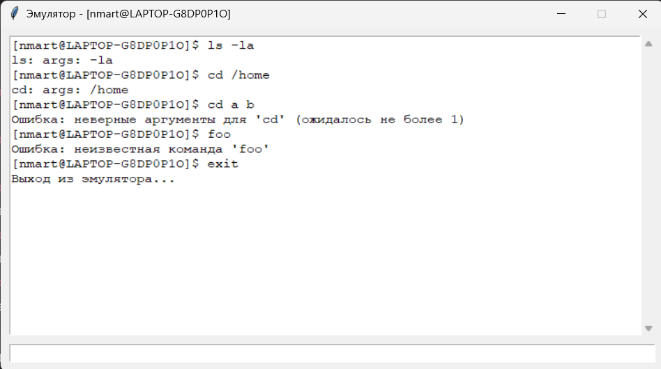
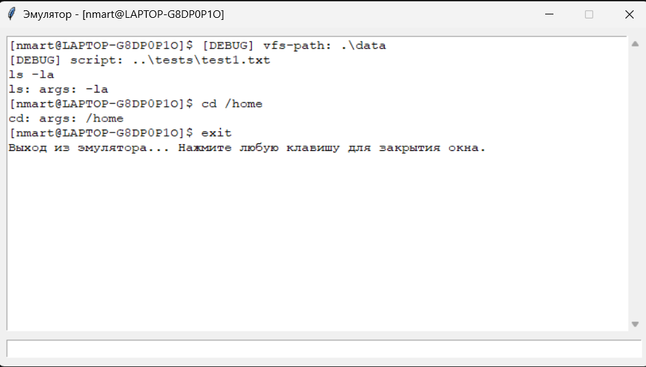
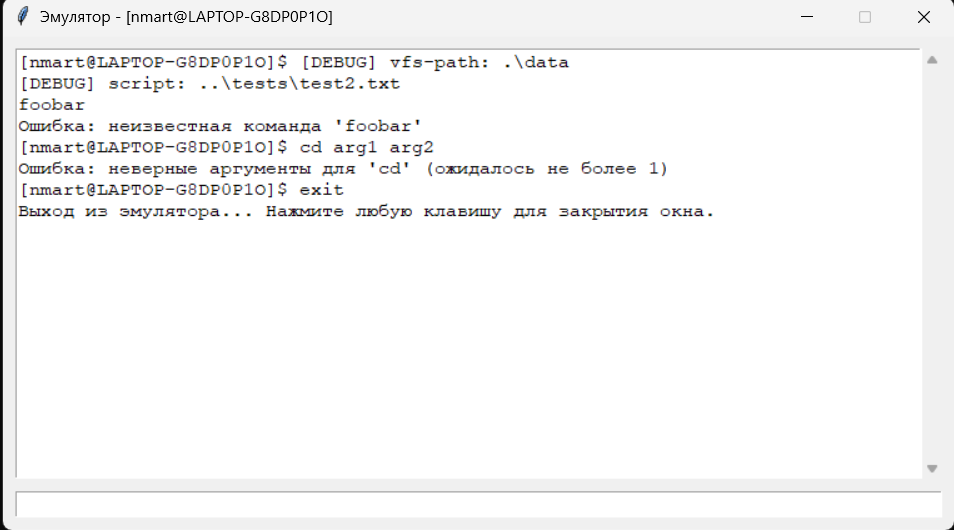
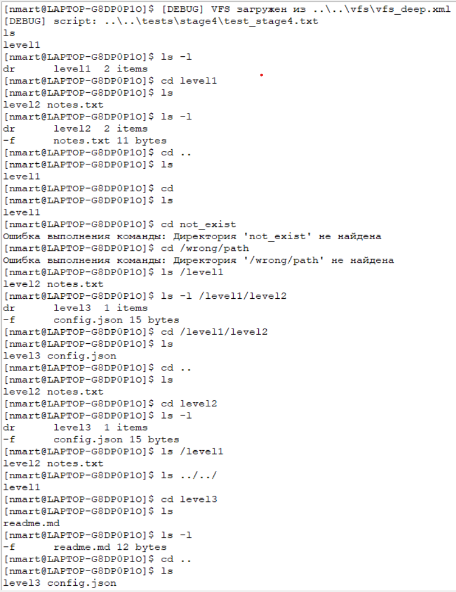
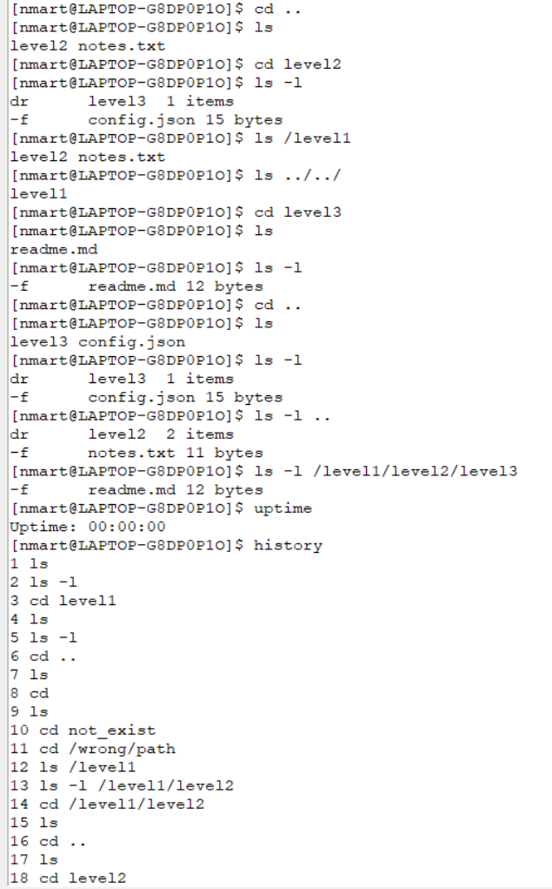
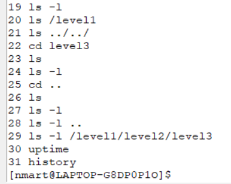
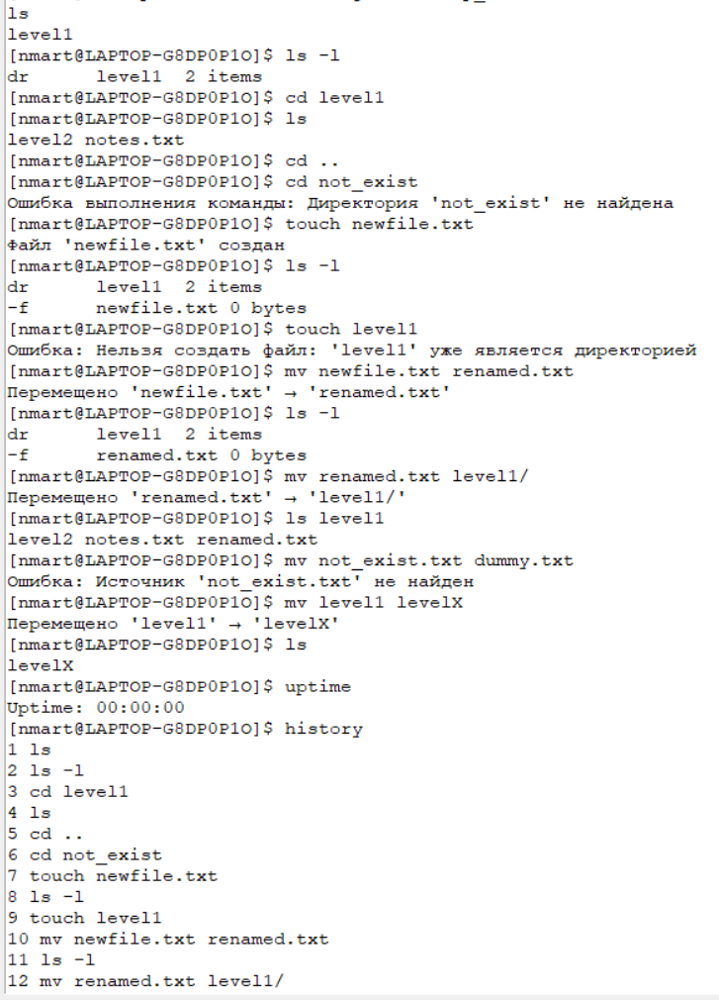
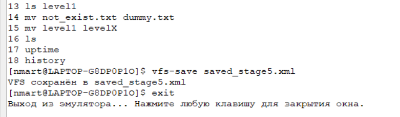

# Задание №1

Вариант 13

Разработать эмулятор для языка оболочки ОС. Необходимо сделать работу
эмулятора как можно более похожей на работу в командной строке UNIX
подобной ОС.

## Эмулятор командной строки (Этап 1: REPL)

### Выполнено

- Минимальный прототип графического эмулятора командной строки, выполненный на Python (Tkinter).
- Реализован REPL-цикл, заглушки команд `ls`, `cd`, обработка ошибок и команда `exit`.

### Демонстрация работы прототипа в интерактивном режиме



## Требования

- Python 3.8+
- Tkinter

---

## Запуск

Перейдите в папку `console` и выполните:

```bash
python gui_repl.py
```

---

## Этап 2: Конфигурация

### Выполнено

- Добавлена поддержка аргументов командной строки:
  - `--vfs-path` — путь к виртуальной файловой системе (VFS).
  - `--script` — путь к стартовому скрипту.
- Реализовано выполнение стартового скрипта:
  - поддержка комментариев (`#`),
  - вывод команд и их результатов в окно эмулятора,
  - обработка ошибок без прерывания работы скрипта.
- Добавлены тестовые скрипты:
  - `tests/test1.txt` — демонстрация корректных команд,
  - `tests/test2.txt` — демонстрация ошибок.
- Созданы `.bat` файлы для запуска тестов на Windows.

### Демонстрация работы

**Пример запуска с тестовым скриптом:**

```bash
python ..\gui_repl.py --vfs-path .\data --script ..\tests\test1.txt
```



**Пример работы с ошибками в скрипте:**

```bash
python ..\gui_repl.py --vfs-path .\data --script ..\tests\test2.txt
```



---

## Запуск

- Для запуска со скриптом используйте параметры:

```bash
python ..\gui_repl.py --vfs-path .\data --script ..\tests\test1.txt
```

- Также можно использовать готовые `.bat` файлы в папке `scripts\`.

## Этап 3: Виртуальная файловая система (VFS)

### Выполнено

- Реализована поддержка виртуальной файловой системы (VFS) в формате XML:
  - загрузка файловой структуры из XML,
  - сохранение текущего состояния в XML,
  - поддержка файлов и директорий, содержимое файлов хранится в Base64.
- Реализованы команды для работы с VFS:
  - `vfs-save <path>` — сохранение текущей файловой системы в указанный XML-файл.
- Обработаны ошибки:
  - проверка корректности структуры XML при загрузке.

### Тестирование

- Добавлен стартовый скрипт `tests/stage3/startup_test.txt`, который проверяет:

  - базовые команды REPL (`ls`, `cd`, ошибки, `exit`),
  - работу с VFS (загрузка, навигация, сохранение),
  - обработку ошибок (`cd not_exist`, некорректные аргументы и т.д.).

- Для запуска используется `.bat` файл:

```bash
python ..\..\gui_repl.py --vfs-path ..\..\vfs\vfs_deep.xml --script ..\..\tests\stage3\startup_test.txt

```

## Этап 4: Основные команды

### Выполнено

- Расширена функциональность эмулятора командной строки:
  - Реализованы команды **`ls`** и **`cd`**, имитирующие работу в UNIX-подобных системах:
    - поддержка относительных (`.` и `..`) и абсолютных (`/path/to/dir`) путей,
    - поддержка альтернативного разделителя `\`,
    - отображение файлов и директорий в кратком и расширенном (`-l`) режиме,
    - корректная обработка ошибок при обращении к несуществующим директориям или файлам.
  - Реализована команда **`uptime`**, отображающая время работы эмулятора.
  - Реализована команда **`history`**, сохраняющая список выполненных команд с порядковыми номерами.
- Создан стартовый тестовый скрипт `tests/stage4/test_stage4.txt`:
  - проверяет работу всех команд (`ls`, `cd`, `uptime`, `history`),
  - демонстрирует корректное поведение с абсолютными и относительными путями,
  - включает примеры с обработкой ошибок.

---

### Функции

- **`ls`**

  - `ls` — вывести содержимое текущей директории;
  - `ls <path>` — вывести содержимое указанного пути (абсолютного или относительного);
  - `ls -l` — вывести содержимое с указанием типа объекта и дополнительной информации (размер файлов, количество элементов в каталогах);
  - поддерживает `.` (текущая директория), `..` (родительская директория), `/` (корень).

- **`cd`**

  - `cd <path>` — перейти в указанную директорию;
  - `cd` без аргументов — переход в корневую директорию;
  - обработка ошибок при попытке перехода в несуществующую директорию.

- **`uptime`**

  - показывает время работы эмулятора в формате `HH:MM:SS`.

- **`history`**
  - выводит список всех выполненных команд с их номерами.

---

### Команды для сборки и запуска

#### Запуск в интерактивном режиме:

```bash
python ..\..\gui_repl.py --vfs-path ..\..\vfs\vfs_deep.xml
```

#### Запуск c тестовым скриптом:

```bash
python ..\..\gui_repl.py --vfs-path ..\..\vfs\vfs_deep.xml --script ..\..\tests\stage4\test_stage4.txt
```

#### Для удобства можно использовать готовые .bat файлы в папке scripts\.

---

### Демонстрация работы

**Пример запуска с тестовым скриптом:**





---

## Этап 5: Дополнительные команды

### Выполнено

- Добавлена поддержка команд, изменяющих состояние виртуальной файловой системы (VFS) в памяти:

  - Реализована команда **`touch`**:

    - создание нового файла в текущей или указанной директории,
    - запрет на создание файлов с именами существующих директорий,
    - корректная обработка ошибок (например, при некорректном пути).

  - Реализована команда **`mv`**:

    - перемещение файлов и директорий,
    - переименование файлов и директорий,
    - поддержка работы как с абсолютными, так и с относительными путями,
    - корректная обработка ошибок (несуществующие объекты, неверные пути).

- Создан стартовый тестовый скрипт `tests/stage5/startup_test.txt`:

  - демонстрирует работу `touch` и `mv`,
  - включает примеры с корректным выполнением и обработкой ошибок,
  - проверяет взаимодействие с ранее реализованными командами (`ls`, `cd`, `uptime`, `history`).

---

### Функции

- **`touch`**

  - `touch <file>` — создаёт новый файл в текущей директории;
  - `touch <path/to/file>` — создаёт новый файл по указанному пути;
  - ошибка при попытке создать файл с именем существующей директории.

- **`mv`**

  - `mv <src> <dst>` — переименование файла или директории;
  - `mv <src> <dir/>` — перемещение объекта в указанную директорию;
  - поддержка абсолютных и относительных путей;
  - корректная обработка ошибок при некорректных путях или отсутствии источника.

---

### Команды для сборки и запуска

#### Запуск в интерактивном режиме:

```bash
python ..\..\gui_repl.py --vfs-path ..\..\vfs\vfs_deep.xml
```

#### Запуск с тестовым скриптом:

```bash
python ..\..\gui_repl.py --vfs-path ..\..\vfs\vfs_deep.xml --script ..\..\tests\stage5\startup_test.txt
```

#### Для удобства можно использовать готовые `.bat` файлы в папке `scripts\`.

---

### Демонстрация работы

**Пример запуска с тестовым скриптом:**



